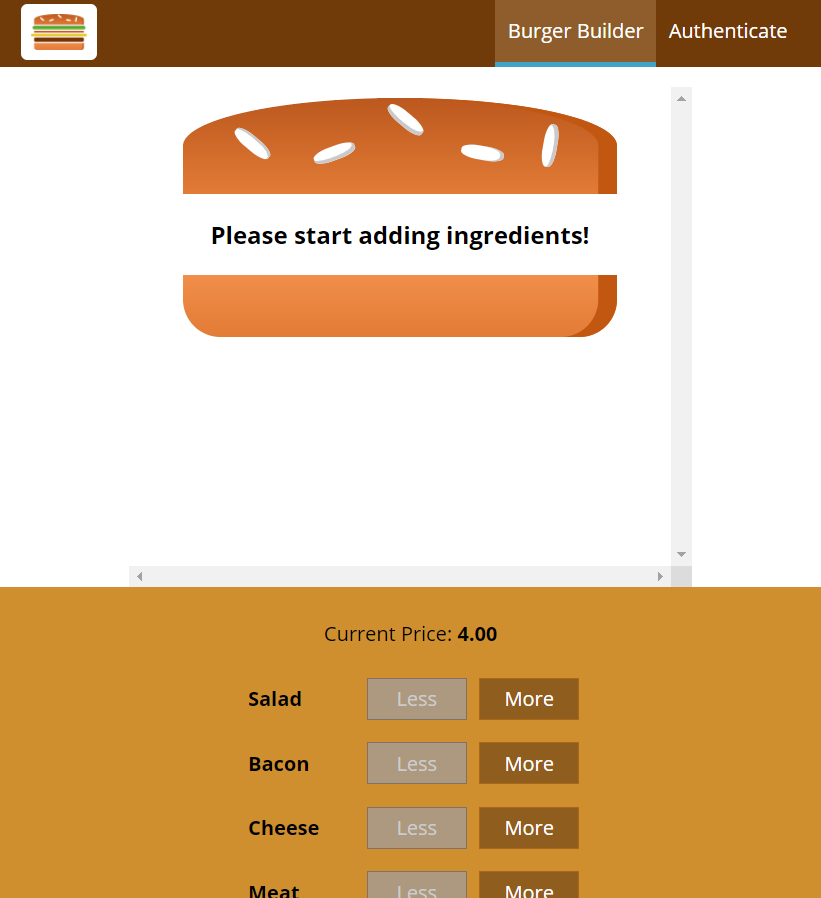

## The Burger Builder

📝 This repository contains React exercises followed through Udemy course on topic ''React - The Complete Guide (incl Hooks, React Router, Redux)''

### https://bilder-burger-app.web.app/

### Usage

.env file should look like this:

    REACT_APP_BASE_URL = databaseName
    REACT_APP_API_KEY  = API_KEY

### Getting started

    git clone https://github.com/merima98/BurgerBuilder.git
    npm install
    npm start

### Testing application:

    npm test
